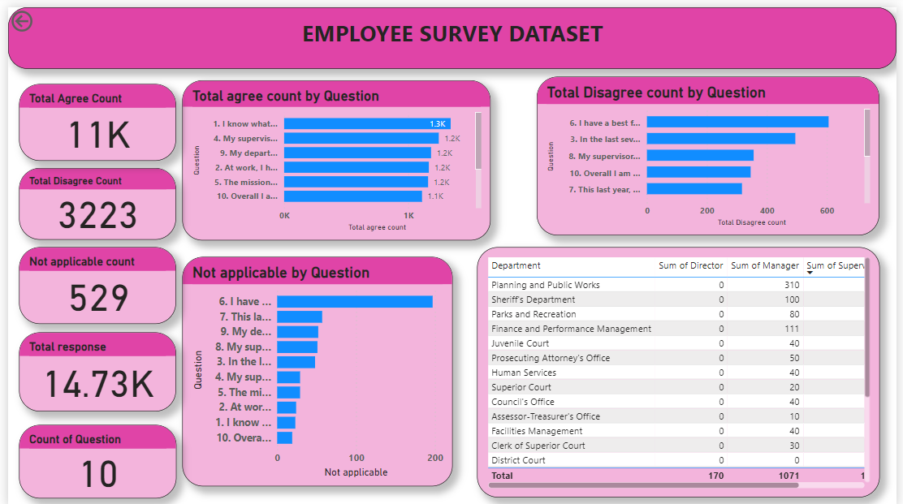
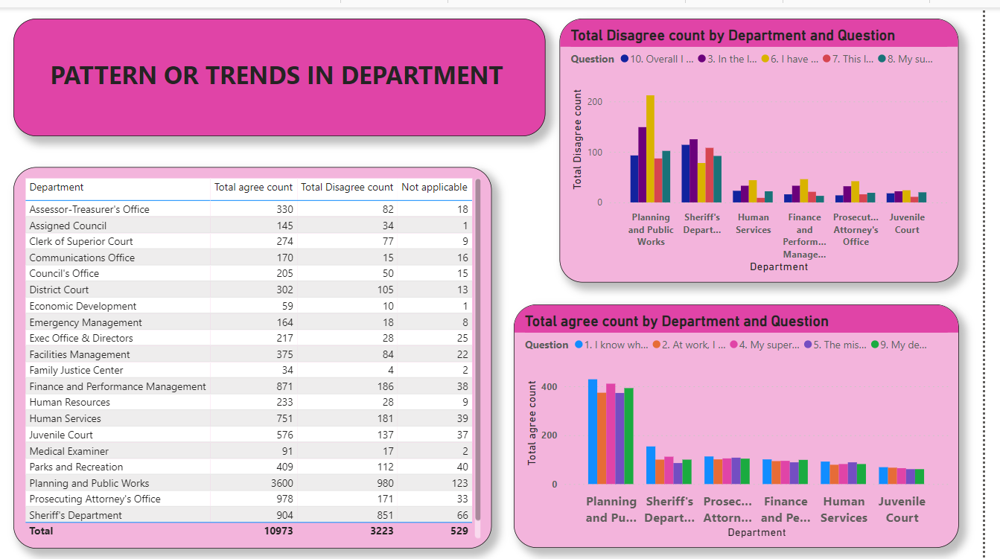
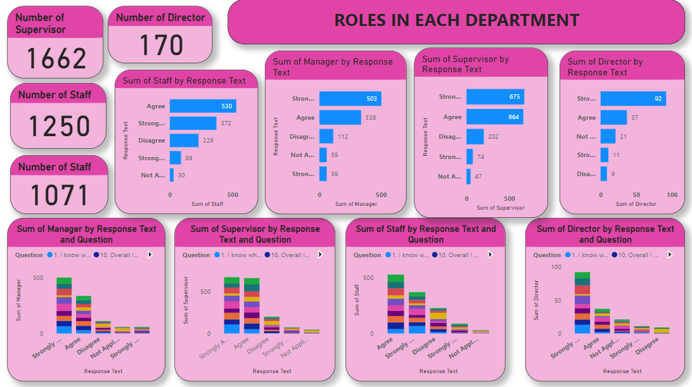

# Employee-survey-analysis

## Introduction 

This is a Power Bi project called **The Employee Survey Responses**. Which contains actual responses from an employee engagement survey conducted by Pierce County WA and completed voluntarily by government employees. The dataset is a Single table and contains 14,725 records. The total number of fields is 10. The project is to analyze and derive insights to crucial questions and help the employers make data driven decisions. 

## Problem Statement 
1. Which survey questions did respondents agree with or disagree with most? 
2. Do you see any patterns or trends by department or role?
3. As an employer, what steps might you take to improve employee satisfaction based on the survey results?

## Skills Demonstrated:
The following power bi features were applied:
- Data cleaning,
- Removing duplicates,
- New measure,
- Tooltips,
- Filter

## Modelling: 
Since its a single tabled data set no modelling was derived.

## Visualization: 
The report consist of three pages
1. Employee_survey
2. Patterns
3. Roles_in

## Features: 
Consist of 3 stacked bar charts used to visualize the total agree count , Disagree count and Not applicable count by question.
Consist of Two tables used to show the sum of staff,Supervisor and Manager by Department, and the total agree,disagree and not applicable count by department 
Consist of two clustered column chart and four stacked column chart.

## Analysis 

### Employee Analysis 

There were a total of 10 questions and 14,725 responded . The total agree count is 11k. The top 5 questions in which the employee agreed the most with are questions 1,4,2,9 and 5.the total disagree count is 3223.  The top 6 questions in which the employees disagree with the most are questions 6,3,8,10 and 7.
To get the total agree count the agree count and strongly agree count was summed up. The same was done for the total disagree count.

### Patterns in Department 

It has a total of 21 departments in which Planning and Public Works has the highest number of responses with a total of 4.5k in which it has the highest number of  agree count (3600) and the highest number of  disagree count (980). It's safe to say that they have the highest number of staff considering the total number of responses.  In which the question I know what is expected of me at work is the one they agreed with most with a total of 429 responses. And I have a best friend at work being the one they disagreed with the most with a total of 212 responses.

### Roles in the Department 

There are four major roles in the department. The supervisor, the director, the manager and the staff.
The supervisor role having the highest Agree count at 675 and director having the lowest at 92. Some of the agreed questions are question 1 which is I know what is expected of me at work, question 10 which is overall i'm satisfied with my job, question 2 which is at work i have the opportunity to do what i like to do best. and the one they disagreed with the most is question 6 which is i have a best friend at work.

### Recommendation 
From the analysis above the employees in planning and works department disagreed about being recognized or received praise from doing good works, so i recommend an employee of the week badge be given to the best employee in planning and works department this would enable them to see that their effort are being seen. Then the sherrifs department also diagreed on being satisfied with their job so i recommend another survey be carried out to understand why they are not satisified with their job.

